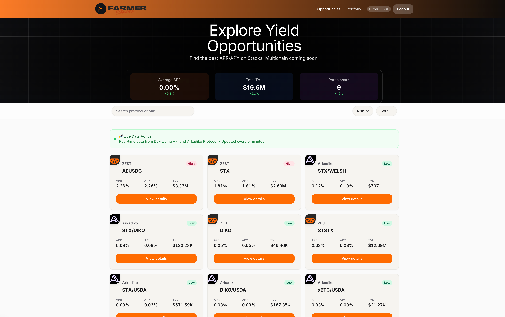
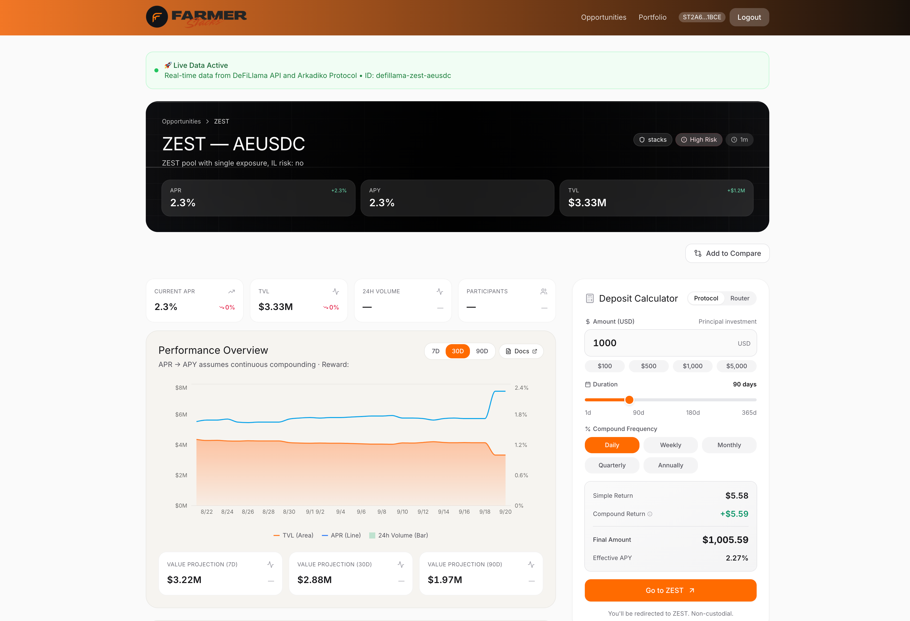
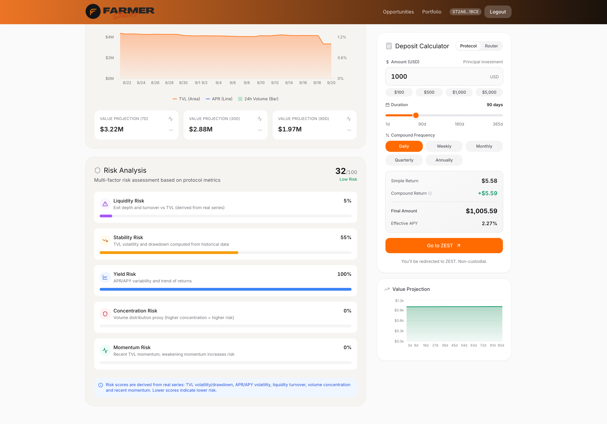

# Farmer


A comprehensive DeFi yield farming aggregator built for the Stacks ecosystem, with planned expansion to Ethereum and Solana. This platform aggregates yield opportunities from multiple protocols, provides normalized APR/APY data with risk scoring, and enables secure deposits through an intelligent router contract.

## 🏗️ Architecture Overview

This project is built as a **pnpm monorepo** with the following workspace structure:

```
farmer/
├── packages/
│   ├── shared/           # Core types and utilities
│   ├── adapters/         # Protocol adapters
│   └── contracts/       # Smart contracts
└── apps/
    ├── web/             # Next.js 14 web application
    └── mobile/          # Expo React Native app
```

## 🚀 Features

### Current Implementation
- **Multi-Protocol Aggregation**: Integrates with ALEX, Arkadiko, and DefiLlama APIs
- **Smart Contract Router**: Secure Clarity contract with safety guards and owner controls
- **Real-time Data**: Cached data fetching with retry mechanisms and rate limiting
- **Risk Assessment**: Comprehensive risk scoring and labeling system
- **Modern UI**: Responsive Next.js application with animated components

### Security Features
- **Owner-only Controls**: Protocol allowlist, pause functionality, transaction caps
- **Validation Layers**: Amount validation, slippage protection, adapter verification
- **Event Logging**: Comprehensive event tracking for deposits and errors
- **Error Boundaries**: Graceful error handling with auto-retry mechanisms

## 📦 Workspace Structure

### Core Packages

#### `@shared/core`
- **Purpose**: Shared TypeScript types and utilities
- **Key Exports**:
  - `Opportunity` interface for yield farming data
  - `Adapter` interface for protocol integrations
  - `Chain` type for multi-chain support
  - Risk calculation utilities

#### `@adapters/core`
- **Purpose**: Protocol adapter implementations
- **Current Adapters**:
  - `AlexAdapter`: ALEX DEX protocol integration
  - `ArkadikoAdapter`: Arkadiko lending protocol
  - `DefiLlamaAdapter`: Cross-chain yield aggregator
- **Features**: Caching, retry logic, rate limiting, error handling

#### `@contracts/core`
- **Purpose**: Clarity smart contracts using Clarinet 3.x
- **Key Contract**: `router.clar` - Yield router with security features
- **Testing**: Vitest + Vite with Clarinet SDK integration

### Applications

#### `@apps/web`
- **Framework**: Next.js 14 with App Router
- **Styling**: Tailwind CSS with custom design system
- **Animation**: Framer Motion for smooth interactions
- **State Management**: Zustand with React Query for data fetching
- **Key Features**:
  - Landing page with quick stats
  - Opportunities grid with risk indicators
  - Individual opportunity details
  - Portfolio tracking (coming soon)

#### `@apps/mobile`
- **Framework**: Expo React Native
- **Status**: Basic structure implemented
- **Future**: Mobile companion app

## 🧪 Smart Contract Architecture

### Router Contract Logic Flow

```mermaid
graph TB
    %% Contract State
    subgraph "Contract Storage"
        A["owner: principal"]
        B["paused: bool"]
        C["per-tx-cap: uint"]
        D["allowed-protocols: map<br/>{id: uint = protocol-entry}"]
    end

    %% Owner Functions
    subgraph "Owner-Only Functions"
        E["set-paused<br/>paused: bool"]
        F["set-tx-cap<br/>cap: uint"]
        G["allow-protocol<br/>id: uint<br/>target: principal<br/>token: principal<br/>adapter: principal"]
        H["is-protocol-allowed<br/>id: uint → bool"]
    end

    %% Main Deposit Flow
    subgraph "Deposit Flow Validation"
        I["route-deposit<br/>token: sip10-token<br/>amount: uint<br/>protocol-id: uint<br/>min-out: uint<br/>adapter: yield-adapter"]

        %% Validation Checks
        J{"Contract<br/>Paused?"}
        K{"Amount > 0?"}
        L{"Amount ≤<br/>TX Cap?"}
        M{"Protocol<br/>Allowed?"}
        N{"Protocol Entry<br/>Exists?"}
        O{"Token<br/>Match?"}
        P{"Adapter<br/>Match?"}
        Q{"Token Transfer<br/>Success?"}
        R{"Adapter Deposit<br/>Success?"}
        S{"Output ≥<br/>Min-Out?"}
    end

    %% Error States
    subgraph "Error Codes"
        T["ERR-NOT-AUTH: 100"]
        U["ERR-PAUSED: 200"]
        V["ERR-INVALID-AMOUNT: 201"]
        W["ERR-AMOUNT-TOO-HIGH: 202"]
        X["ERR-NOT-ALLOWED: 300"]
        Y["ERR-ADAPTER-MISMATCH: 301"]
        Z["ERR-TRANSFER-FAILED: 302"]
        AA["ERR-SLIPPAGE: 303"]
        AB["ERR-ADAPTER-FAILED: 304"]
    end

    %% Event Logging
    subgraph "Events"
        AC["route-deposit event"]
        AD["adapter-error event"]
    end

    %% Data Flow
    %% Owner controls
    A --> E
    A --> F
    A --> G
    D --> H
    G --> D

    %% Deposit validation flow
    I --> J
    J -- Yes --> T
    J -- No --> K
    K -- No --> V
    K -- Yes --> L
    L -- No --> W
    L -- Yes --> M
    M -- No --> X
    M -- Yes --> N
    N -- No --> X
    N -- Yes --> O
    O -- No --> Y
    O -- Yes --> P
    P -- No --> Y
    P -- Yes --> Q
    Q -- No --> Z
    Q -- Yes --> R
    R -- No --> AD
    R -- Yes --> S
    S -- No --> AA
    S -- Yes --> AC

    %% Event relationships
    R -- Success --> AC
    R -- Error --> AD

    %% Styling
    classDef state fill:#e1f5fe,stroke:#01579b,stroke-width:2px
    classDef function fill:#f3e5f5,stroke:#4a148c,stroke-width:2px
    classDef validation fill:#fff3e0,stroke:#e65100,stroke-width:2px
    classDef error fill:#ffebee,stroke:#b71c1c,stroke-width:2px
    classDef event fill:#e8f5e8,stroke:#2e7d32,stroke-width:2px

    class A,B,C,D state
    class E,F,G,H function
    class I,J,K,L,M,N,O,P,Q,R,S validation
    class T,U,V,W,X,Y,Z,AA,AB error
    class AC,AD event
```



#### Key Components

**Data Structures**
- `allowed-protocols`: Map storing protocol configurations (target, token, adapter)
- **Owner Variables**: `owner`, `paused`, `per-tx-cap` for security controls

**Security Layers**
1. **Authorization**: Owner-only functions for critical operations
2. **Pause Control**: Emergency stop functionality
3. **Transaction Caps**: Per-transaction amount limits
4. **Protocol Allowlist**: Only approved protocols can be used
5. **Input Validation**: Amount, protocol, and slippage validation
6. **Token/Adapter Verification**: Ensures correct token and adapter pairing

**Deposit Flow Steps**
1. **Validation**: Check pause status, amount limits, protocol allowlist
2. **Protocol Lookup**: Retrieve protocol configuration from map
3. **Verification**: Match provided token/adapter with stored values
4. **Token Transfer**: Move tokens from user to adapter contract
5. **Adapter Deposit**: Call protocol's deposit function
6. **Slippage Check**: Ensure output meets minimum requirement
7. **Event Logging**: Record successful deposit or adapter errors

#### Security Features

- **Owner Management**: Deployer as initial owner with transfer capability
- **Pause Functionality**: Emergency pause to halt all operations
- **Protocol Allowlist**: Only approved protocols can be used
- **Transaction Caps**: Per-transaction limits to prevent large losses
- **Comprehensive Error Handling**: Specific error codes for all failure scenarios
- **Event Logging**: Audit trail for all deposits and errors

### Router Contract (`router.clar`)

The core smart contract implements secure yield routing with the following features:

#### Security Controls
- **Owner Management**: Deployer as initial owner with transfer capability
- **Pause Functionality**: Emergency pause to halt all operations
- **Protocol Allowlist**: Only approved protocols can be used
- **Transaction Caps**: Per-transaction limits to prevent large losses

#### Core Functions
```clarity
;; Owner-only functions
(set-paused (bool))
(set-tx-cap (uint))
(allow-protocol (uint principal principal principal))

;; Main deposit function
(route-deposit (token amount protocol-id min-out adapter))
```

#### Traits System
- `yield-adapter`: Standard interface for protocol adapters
- `sip10-token`: SIP-010 token compatibility

#### Error Handling
Comprehensive error codes for all failure scenarios:
- `ERR-NOT-AUTH` (100): Unauthorized access
- `ERR-PAUSED` (200): Contract paused
- `ERR-INVALID-AMOUNT` (201): Invalid amount
- `ERR-SLIPPAGE` (302): Slippage exceeded

### Testing Framework
- **Vitest**: Modern testing framework with Clarinet integration
- **Clarinet SDK**: Smart contract testing utilities
- **Coverage**: Code coverage and cost analysis
- **Matchers**: Custom Clarity value matchers

### Usage Examples

#### Contract Development
```bash
# Start interactive Clarinet console
pnpm contracts:console

# Check contract syntax
pnpm contracts:check

# Run all tests with coverage
pnpm test:contracts

# Run tests with cost analysis
cd packages/contracts/yield-router
pnpm test:report
```

#### Contract Interaction
```bash
# Deploy contract (testnet)
clarinet deploy --testnet

# Call contract functions
clarinet console --manifest ./Clarinet.toml
> (contract-call? 'router set-paused true)
> (contract-call? 'router allow-protocol u1 'SP2ZNGJ85ENDY6QRHQ5P2D4FXKGZWCKTB2T0Z55KZ 'SP2ZNGJ85ENDY6QRHQ5P2D4FXKGZWCKTB2T0Z55KZ 'SP2ZNGJ85ENDY6QRHQ5P2D4FXKGZWCKTB2T0Z55KZ)
> (stx-transfer u1000 tx-sender 'SP2ZNGJ85ENDY6QRHQ5P2D4FXKGZWCKTB2T0Z55KZ)
```

#### Testing Commands
```bash
# Run specific test file
vitest run router.test.ts

# Run with coverage
vitest run --coverage

# Watch mode for development
vitest watch
```

## 🔄 Data Flow Architecture

### Adapter Pattern
All protocol integrations implement the `Adapter` interface:

```typescript
interface Adapter {
  list(): Promise<Opportunity[]>;
  detail(id: string): Promise<Opportunity>;
  getProtocolInfo(): ProtocolInfo;
}
```

### Data Pipeline
1. **Data Fetching**: Adapters fetch from protocol APIs
2. **Normalization**: Data standardized to `Opportunity` format
3. **Caching**: 5-minute cache with automatic cleanup
4. **Risk Assessment**: Automatic risk scoring and labeling
5. **UI Display**: React components with real-time updates

### Caching Strategy
- **Opportunity Cache**: 5-minute TTL
- **Stats Cache**: 10-minute TTL
- **Automatic Cleanup**: Background cleanup every 10 minutes
- **Memory Efficient**: Map-based storage with expiration

## 🎨 Frontend Architecture

### Component System
- **HeroRightChart**: Animated metrics dashboard
- **ErrorBoundary**: Graceful error handling with auto-retry
- **SoftParticles**: Dynamic background effects
- **Risk Indicators**: Color-coded risk assessment

### Design System
- **Color Palette**: Brand orange (#FF6A00), warm gold (#E2C872)
- **Gradient System**: Section-specific gradients
- **Typography**: Consistent hierarchy with Inter font
- **Animations**: Framer Motion with reduced motion support

### State Management
- **Zustand**: Lightweight state management
- **React Query**: Server state management
- **Local Storage**: Persistent user preferences

## 🛠️ Development Workflow

### Prerequisites
- **Node.js**: >= 18.0.0
- **pnpm**: >= 8.0.0
- **Git**: For version control

### Setup
```bash
# Clone repository
git clone <repository-url>
cd stacks-yield-agg

# Install dependencies
pnpm install

# Build packages
pnpm build
```

### Development Commands
```bash
# Development servers
pnpm dev:web              # Next.js web app
pnpm dev:mobile           # Expo mobile app

# Testing
pnpm test                 # All tests
pnpm test:contracts       # Smart contract tests
pnpm test:adapters        # Adapter tests

# Code quality
pnpm typecheck           # TypeScript checks
pnpm lint                # ESLint
pnpm format              # Prettier

# Contract development
pnpm contracts:check     # Clarity syntax check
pnpm contracts:console   # Clarinet REPL
```

### Single Package Development
```bash
# Build specific packages
pnpm --filter @shared/core build
pnpm --filter @adapters/core build

# Test specific packages
pnpm --filter @contracts/core test
```

## 📊 Testing Strategy

### Smart Contract Testing
- **Unit Tests**: 11 comprehensive tests covering all functions
- **Security Tests**: Owner controls, pause functionality, validation
- **Integration Tests**: Full deposit flow with mock adapters
- **Coverage**: Code coverage and cost analysis

### Frontend Testing
- **Component Tests**: React component testing with Jest
- **Integration Tests**: Data flow and user interactions
- **E2E Tests**: End-to-end testing (planned)

### Test Coverage
- **Contracts**: 100% function coverage
- **Adapters**: Error handling and retry logic
- **UI**: Critical user paths and error states

## 🔒 Security Considerations

### Smart Contract Security
- **Access Controls**: Owner-only for sensitive functions
- **Input Validation**: Amount, protocol, and slippage validation
- **Reentrancy Protection**: Clarity's built-in protection
- **Event Logging**: Comprehensive audit trail

### Frontend Security
- **Risk Labeling**: Clear risk indicators for all opportunities
- **BETA Disclaimers**: Proper warnings for experimental features
- **Error Boundaries**: Graceful failure handling
- **Data Validation**: Input sanitization and validation

### API Security
- **Rate Limiting**: Configurable per-adapter limits
- **Retry Logic**: Exponential backoff for failed requests
- **Error Handling**: Secure error message handling
- **Data Validation**: Type checking and validation


## Screenshots






## 🌐 Multi-Chain Strategy

### Current Phase: Stacks Ecosystem
- **ALEX Protocol**: Automated market maker
- **Arkadiko**: Lending and borrowing
- **DefiLlama**: Cross-chain yield data

### Phase B: Ethereum Integration
- **Uniswap**: DEX integration
- **Compound**: Lending protocol
- **Curve**: Stablecoin pools

### Phase C: Solana Integration
- **Raydium**: DEX integration
- **Saber**: Stablecoin protocol
- **Marinade**: Staking derivatives

## 📈 Performance Optimization

### Caching Strategy
- **Multi-level Caching**: Memory, API, and browser caching
- **Cache Invalidation**: Time-based and event-driven
- **Background Refresh**: Stale-while-revalidate pattern

### Bundle Optimization
- **Code Splitting**: Route-based and component-based
- **Tree Shaking**: Dead code elimination
- **Lazy Loading**: On-demand component loading

### API Optimization
- **Batching**: Multiple requests in single calls
- **Compression**: Gzip compression for responses
- **CDN**: Static asset delivery

## 🚀 Deployment

### Smart Contract Deployment
```bash
# Deploy to Stacks mainnet
cd packages/contracts/yield-router
clarinet deploy

# Deploy to testnet
clarinet deploy --testnet
```

### Frontend Deployment
```bash
# Build for production
pnpm build

# Deploy to Vercel/Netlify
cd apps/web
npm run deploy
```

### Environment Variables
```bash
# Required environment variables
NEXT_PUBLIC_STACKS_NETWORK=mainnet
NEXT_PUBLIC_API_BASE_URL=https://api.example.com
NEXT_PUBLIC_ROUTER_CONTRACT=SP123...router
```

## 🤝 Contributing

### Development Guidelines
1. **TypeScript**: Strict mode enabled
2. **Testing**: All changes must have tests
3. **Linting**: Pass ESLint and Prettier checks
4. **Documentation**: Update README for new features

### Git Workflow
1. **Branch Strategy**: Feature branches from main
2. **Commit Messages**: Conventional commits
3. **Pull Requests**: Comprehensive reviews
4. **CI/CD**: Automated testing and deployment

### Code Standards
- **Formatting**: Prettier with consistent config
- **Linting**: ESLint with TypeScript rules
- **Testing**: Vitest for contracts, Jest for frontend
- **Documentation**: JSDoc comments for all functions

## 📄 License

This project is licensed under the MIT License - see the LICENSE file for details.

## 🙏 Acknowledgments

- **Stacks ecosystem** for the blockchain infrastructure
- **ALEX and Arkadiko** protocols for their DeFi platforms
- **DefiLlama** for comprehensive yield data
- **Clarinet team** for the excellent development environment

## 📞 Support

For support, please:
- Open an issue on GitHub
- Check the documentation in the `docs/` folder

---

Built with ❤️ for the Stacks ecosystem

---

**Farmer** - Yield farming aggregation made simple.
